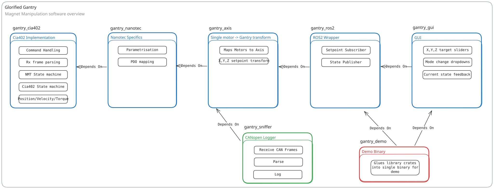

# Gantry Control System

A Rust-based software driver stack for controlling CiA 402-compliant motors in gantry configurations over CANopen from x86 Linux environments. This workspace implements a complete event-driven control system using Tokio's multithreaded async runtime.

## Workspace Structure

This repository contains 6 crates organized as follows:

_Core Libraries_

- `gantry-cia402` - Low-level CiA 402 motor driver implementation
- `gantry-axis` - Multi-axis gantry coordination layer
- `gantry-ros2` - ROS2 bridge for integration with robotics systems
- `gantry-demo` - Shared testing utilities and example configurations

_Applications_

- `gantry-sniffer` - CANopen bus monitoring and debugging tool
- `gantry-gui` - Desktop GUI for manual gantry control

_System Requirements_

- Platform: `x86_64 Linux`
- Rust Toolchain: Stable (see `rust-toolchain.toml`)
- CAN Interface: `SocketCAN` compatible hardware
- Motors: 1+ `Cia402` compatible Motor Drivers

# Quick start

## Set up CAN interface (can0 & 1 Mbit/s)

Use the Just command runner (`just --help` or see justfile):
`just setup-can`

Or manual setup:

```
    sudo ip link set can0 up type can bitrate 1000000
    sudo ip link set can0 txqueuelen 1000
    sudo ip link set up can0

```

## Run the CANopen sniffer to view CANOpen traffic

`just snif` or `cargo run -p gantry-sniffer`

## Run integration tests (requires connected hardware)

`cargo test -p gantry-cia402 --test basic`

# Architecture Overview

The system is built on the `tokio` async runtime and follows a layered architecture:

```
┌─────────────────────────────────────────┐
│ Applications (gantry-gui, gantry-ros2)  │
├─────────────────────────────────────────┤
│ gantry-axis (Multi-axis coordination)   │
├─────────────────────────────────────────┤
│ gantry-cia402 (Single motor control)    │
├─────────────────────────────────────────┤
│ oze-canopen (CANopen protocol)          │
├─────────────────────────────────────────┤
│ SocketCAN (Linux kernel)                │
└─────────────────────────────────────────┘
```

Each layer communicates via async channels using Tokio's broadcast/mpsc
synchronisation primitives.



## Task Architecture

A `Cia402` compatible driver must perform multiple distinct tasks, these are
modelled as `tokio` async tasks.

### **FEEDBACK Task** (`handle_feedback`)

- **Responsibility**: Receive and parse CAN frames from the bus
- **Key Functions**:
  - Parse raw CAN frames into structured `Frame` types
  - Decode TPDOs into motor feedback (position, velocity, torque, statusword)
  - Broadcast `MotorEvent`s to all subscribers
- **Channels**:
  - Input: `CanOpenInterface.rx` (CAN frames)
  - Output: `broadcast<MotorEvent>` (parsed events)

### **NMT Task** (`nmt_task`)

- **Responsibility**: Manage Network Management state transitions
- **Key Functions**:
  - Track current NMT state
  - Send NMT commands to change device state (PreOperational, Operational, etc.)
  - Coordinate with startup for configuration phases
- **Channels**:
  - Input: `mpsc<NmtState>` (state requests)
  - Input: `broadcast<MotorEvent>` (NMT feedback)
  - Output: `CanOpenInterface.tx` (NMT commands)

### **CIA-SM Task** (`cia402_state_machine_task`)

- **Responsibility**: Track CiA402 state and validate transitions
- **Key Functions**:
  - Decode `StatusWord` into `Cia402State`
  - Validate state transition requests
  - Generate `Cia402Flags` for valid transitions
  - Broadcast state changes
- **Channels**:
  - Input: `broadcast<MotorEvent>` (statusword updates)
  - Input: `mpsc<Cia402State>` (transition requests from orchestrator)
  - Output: `broadcast<Cia402State>` (state updates to orchestrator)
  - Output: `mpsc<Cia402Command>` (transition/update commands to publisher)

### **CIA-OR Task** (`cia402_orchestrator_task`)

- **Responsibility**: Orchestrate multi-step CiA402 state transitions
- **Key Functions**:
  - Calculate transition paths (e.g., Fault → OperationEnabled requires multiple steps)
  - Send individual transition requests to state machine
  - Handle transition timeouts and retries
  - Track progress through transition sequences
- **Channels**:
  - Input: `broadcast<MotorCommand>` (Enable/Disable commands)
  - Input: `broadcast<Cia402State>` (state feedback from SM)
  - Output: `mpsc<Cia402State>` (single transition requests)

### **UPDATE Task** (`publish_updates`)

- **Responsibility**: Aggregate and route motor commands
- **Key Functions**:
  - Convert `MotorCommand`s to `Setpoint`s or `PdoCommand`s
  - Handle mode switches (e.g., entering Cyclic Synchronous Mode)
  - Coordinate between state machine transitions and setpoint writes
- **Channels**:
  - Input: `broadcast<MotorCommand>` (user commands)
  - Input: `mpsc<Cia402Command>` (state machine requests)
  - Output: `mpsc<Setpoint>` (to setpoint manager)
  - Output: `mpsc<PdoCommand>` (to PDO task)

### **SETPOINT MANAGER Task** (`SetpointManager`)

- **Responsibility**: Manage setpoint timing and handshakes
- **Key Functions**:
  - Handle Profile Position handshake (set bit 4, wait for acknowledge, clear bit 4)
  - Manage Cyclic Synchronous Mode setpoint transmission on SYNC
  - Track current setpoint and operational mode
- **Channels**:
  - Input: `mpsc<Setpoint>` (new setpoints)
  - Input: `broadcast<Instant>` (SYNC events)
  - Input: `broadcast<MotorEvent>` (feedback for handshakes)
  - Output: `mpsc<PdoCommand>` (to PDO task)

### **PDO Task** (`Pdo`)

- **Responsibility**: Low-level PDO frame construction and transmission
- **Key Functions**:
  - Maintain RPDO frame state (controlword, operation mode, targets)
  - Apply updates to RPDO frames
  - Send RPDO frames to CAN bus
  - Handle PDO remapping for mode switches
- **Channels**:
  - Input: `mpsc<PdoCommand>` (update requests)
  - Output: `CanOpenInterface.tx` (RPDO frames)

### **STARTUP Task** (`motor_startup_task`)

- **Responsibility**: Initialize motor on power-up
- **Key Functions**:
  - Set device to NMT PreOperational
  - Write motor parameters via SDO (acceleration, velocity limits, etc.)
  - Configure TPDO/RPDO mappings
  - Set device to NMT Operational
- **Channels**:
  - Input: Parameters (`&[SdoAction]`)
  - Output: `mpsc<NmtState>` (NMT transitions)
  - Output: SDO client (parameter writes)

## Key Data Types

### Commands & Events

- **`MotorCommand`**: User-level commands (Enable, Home, MoveAbsolute, SetTorque, etc.)
- **`MotorEvent`**: Device feedback (StatusWord, PositionFeedback, HomingFeedback, etc.)
- **`PdoCommand`**: Low-level PDO operations (WriteSetpoint, WriteCia402Transition, etc.)
- **`Cia402Command`**: State machine commands (Update, Transition)

### State Types

- **`Cia402State`**: CiA402 state machine states (ReadyToSwitchOn, OperationEnabled, etc.)
- **`Cia402Flags`**: Control word flags for state transitions
- **`NmtState`**: CANopen NMT states (PreOperational, Operational, etc.)
- **`OperationMode`**: CiA402 operation modes (ProfilePosition, Homing, CyclicSynchronousPosition, etc.)

### Setpoint Types

- **`Setpoint`**: Enum of all mode-specific setpoints (ProfilePosition, Home, CyclicTorque, etc.)
- **`PositionSetpoint`**: Target position + flags + profile velocity
- **`VelocitySetpoint`**: Target velocity
- **`TorqueSetpoint`**: Target torque
- **`HomingSetpoint`**: Homing flags

## Design Patterns

1. **Task Isolation**: Each task has a single, well-defined responsibility
2. **Event-Driven**: Tasks react to events rather than polling
3. **Channel-Based Communication**: Tasks communicate via typed channels (mpsc/broadcast)

# Toolchain Setup

This project requires both Rust and ROS2 (Jazzy) to build and run. We provide two methods for setting up your development environment.

## Method 1: Using Nix (Recommended)

The preferred method uses Nix to provide a reproducible development environment with all dependencies pre-configured.
[For more info check here](https://nixos.org/download/).

### Installing Nix

**On Linux, Windows(WSL2) and macOS:**

```bash
sh <(curl --proto '=https' --tlsv1.2 -L https://nixos.org/nix/install) --daemon
```

### Entering the Development Shell

**Manual activation:**

```bash
nix develop
```

This will download and configure all required dependencies including:

- Rust toolchain (as specified in `rust-toolchain.toml`)
- ROS2 Jazzy packages + Sourced setup script
- CANopen libraries
- GUI dependencies (wayland, X11)
- Python environment with Poetry

**Automatic activation with direnv (recommended):**

Install direnv:

```bash
# On NixOS or in nix shell
nix-shell -p direnv

# On other systems
sudo apt install direnv  # Debian/Ubuntu
brew install direnv      # macOS
```

Add direnv hook to your shell (`~/.bashrc`, `~/.zshrc`, etc.):

```bash
eval "$(direnv hook bash)"  # or zsh, fish, etc.
```

Create a `.envrc` file in the project root:

```bash
echo "use flake" > .envrc
direnv allow
```

Now the development environment will activate automatically whenever you enter
the project directory, and everything will be undone if you leave this
directory.

## Method 2: Manual Installation

If you cannot or prefer not to use Nix:

### Rust Toolchain

The project uses a specific Rust toolchain defined in `rust-toolchain.toml`. Install rustup:

```bash
curl --proto '=https' --tlsv1.2 -sSf https://sh.rustup.rs | sh
```

Rustup will automatically use the toolchain specified in `rust-toolchain.toml` when you build the project. The file specifies:

- Channel: stable
- Components: rust-analyzer, clippy
- Target: x86_64-unknown-linux-gnu

### ROS2 Jazzy

Follow the official ROS2 Jazzy installation instructions for your platform:

- [Ubuntu installation guide](https://docs.ros.org/en/jazzy/Installation/Ubuntu-Install-Debs.html)
- [Building from source](https://docs.ros.org/en/jazzy/Installation/Alternatives/Ubuntu-Development-Setup.html)

Required ROS2 packages:

- `ros-core`
- `ros2cli`
- `ros2launch`
- `rclcpp`
- `std-msgs`
- `can-msgs`

After installation, source the ROS2 setup script:

```bash
source /opt/ros/jazzy/setup.bash
```

### Additional Dependencies

Install system dependencies required for building:

```bash
# Ubuntu/Debian
sudo apt install build-essential pkg-config libssl-dev \
    libxkbcommon-dev libwayland-dev libgl-dev \
    libfontconfig-dev libegl-dev

# System CAN utilities
sudo apt install can-utils
```

### Verification

Verify your setup:

```bash
# Check Rust
rustc --version
cargo --version

# Check ROS2
ros2 --version
echo $ROS_DISTRO  # should output 'jazzy'

# Build the project
cargo check
```

# Testing

The workspace includes basic tests:

- **Unit tests**: Core logic and state machines
- **Integration tests**: Hardware-in-the-loop tests requiring connected motors
- **Example tests**: Real-world usage scenarios in `gantry-demo/tests/`

Run tests with: `cargo test` (software tests) or `cargo test --test <name>`
(hardware/integration tests).

# FIX

- Cia402Driver: cia402 CW flags are bugged. Sending MotorCmd::Enable + Setpoint
  to motors already in OperationEnabled has correct orchestrator semantics (drive is already
  enabled -> skip) BUT forgets to update the cia402 cw flags causing the setpoint
  RPDO to request cia402 SwitchOnDisabled :(

`2025-10-24T12:28:28.798914Z SNIFF NODE 1  RPDO1 [10, 0, 6]
=> ControlWord(OMS_1) - Homing`

=> Reproduce: reset drives + perform cmd::enable + random setpoint once, see correct operation. Run the same thing again without resetting drives, see bug.
=> Attempted to fix this bug by adding an update from cia402 SM -> pdo, but this
doesnt work fully

- Finish Implementation of Cyclic Synchronous Modes -> just feedback handler is left
  => I fear this isn't very useful on a non-realtime OS.

- Consecutive movement seems broken using `PositionModeFlagsCW::DECELERATE_AFTER_REACHING`

- Profile Torque mode has trouble hitting torque target precisely, sometimes this takes
  ages to converge. -> Listen for torqueFeedback { actual_torque: i32 } instead
  and define a target reached margin myself.
  => This is now done more generally in
  `gantry_axis::event::util::wait_for_target_reached`

- Cia402State::OperationEnabled -> SwitchOnDisabled seems broken, should use quick stop transition?

# TODO

- !! Add logic to gantry-axis that quick stops all motors in an axis when one of
  them reports a fault OR reboots.

- ! Figure out how to map T/RPDO's, and how to generalise de/serialisation

- Invalidate all PDOs in the device before mapping, currently TPDO4 isnt in CUSTOM_TPDOS, so
  its never changed from the default and will generate warnings
  -> quick fix by adding EMPTY_TPDO4

- Make error handling uniform across the driver

- Fuzz test orchestrator state orchestrator/machine, this can be done in isolation without CAN, easy wins
